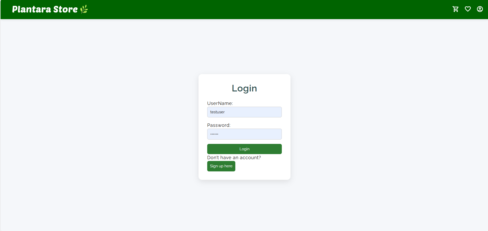
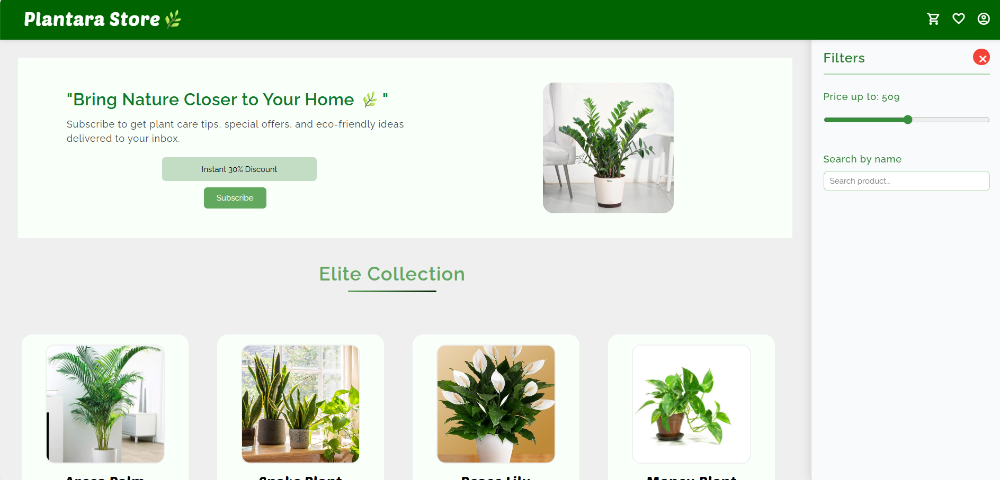
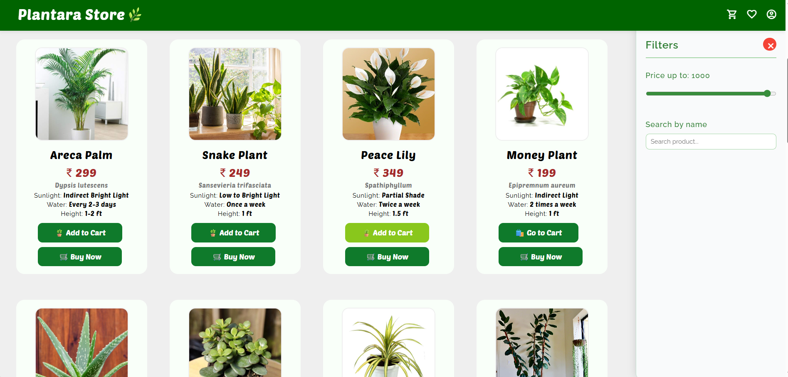
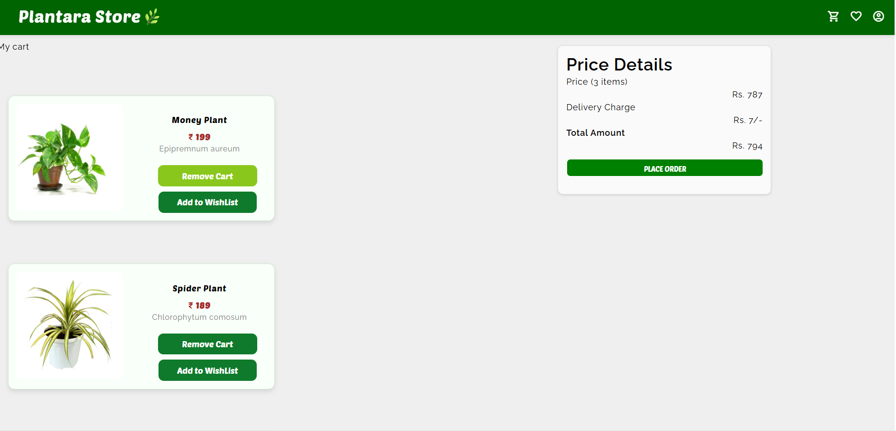
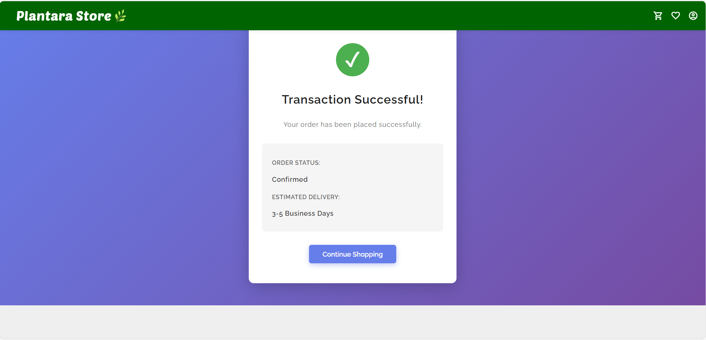

# 🌱 Plantara Store: Full-Stack E-commerce Platform 🛍️🧾

## 🪴 Project Overview
Plantara Store is a modern e-commerce web application crafted for plant lovers. It delivers a complete shopping experience — from discovering plants with detailed care info to managing carts and completing secure checkouts.

This project demonstrates full-stack proficiency, combining a responsive UI with efficient backend logic for authentication, order handling, and data management.

---

## 🌿 Key Features

💧 **User Authentication & Security**  
- Secure Sign Up / Login with robust validation.  
- Implementation of personalized user sessions and data protection mechanisms.

💧 **Advanced Product Browsing & Filtering**  
- **Dynamic Catalog:** Features detailed plant profiles including sunlight requirements, watering frequency, height, and price.  
- **Real-time Filtering:** Includes search functionality and category filtering.  
- **Interactive Price Slider:** Allows users to browse inventory based on a dynamically adjustable price range.

  
 #
 ##
 ###
  
  

💧 **Cart & Wishlist Management**  
- **Seamless Cart Operations:** Easy Add / Remove product functionality.  
- **Auto-Updated Totals:** Real-time calculation of Subtotal, Delivery Charge, and Grand Total.  
- **Wishlist Feature:** Option to save favorite plants for future purchasing.

  

💧 **Checkout & Payment Flow**  
- **Guided Checkout Process:** Designed for maximum conversion.  
- **Payment Confirmation Screen:** Confirms successful transaction completion.

  

---

## 🧰 Tech Stack

| Category | Technologies |
|-----------|---------------|
| 🟢 **Frontend** | React.js, HTML5, CSS3 |
| 🟢 **Backend / API** | Node.js, Express.js |
| 🟢 **Database** | MongoDB (Mongoose ORM) |

---

## 🚀 Getting Started (Local Setup)

### 1️⃣ Install Dependencies:

### Install root dependencies (if applicable)
npm install

### Install client dependencies
cd src && npm install

### Install server dependencies
cd server && npm install

### 2️⃣ Set Up Environment Variables:

Create a .env file inside the server folder and define:

MONGO_URI=<your_database_uri>
JWT_SECRET=<your_secret_key>
PORT=5000

### 3️⃣ Run the Application:
### Start the backend server first
npm start

### In a new terminal, start the frontend
npm start

The application will be accessible at:
👉 http://localhost:3000

📸 Preview

🤝 Contributions

Pull requests are welcome.
For major feature changes, please open an issue first to ensure alignment with the project's direction.
